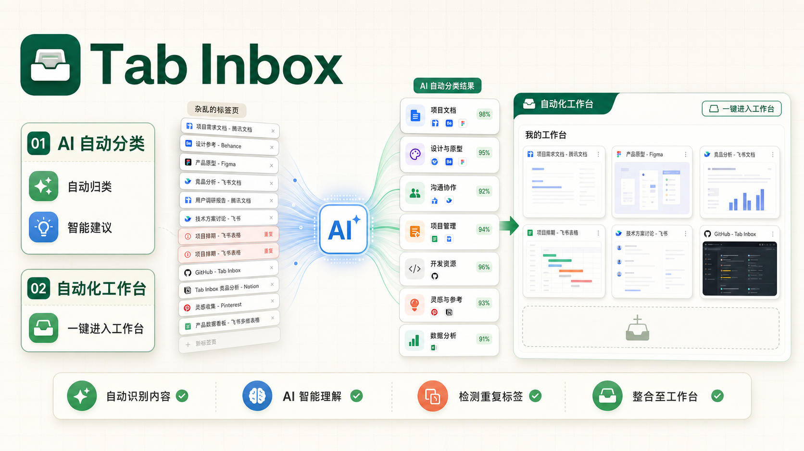

<p align="center">
  
</p>

<h1 align="center">Tab Inbox</h1>

<p align="center">
  A local-first Chrome extension dashboard for turning messy tabs into calm, grouped workspaces.
</p>

<p align="center">
  <strong>English</strong> · <a href="README.zh-CN.md">简体中文</a>
</p>

<p align="center">
  
  
  
</p>

<p align="center">
  
</p>

## What is Tab Inbox?

Tab Inbox replaces a tiny extension popup with a full-page command center for tab cleanup. It helps you scan open tabs, group related pages, save useful links for later, archive context, and keep a temporary workspace for the thing you are doing right now.

It is designed to be local-first: rule matching, grouping memory, dashboard state, saved items, and archives live in Chrome extension storage. AI grouping is optional and only runs after the user configures an OpenAI-compatible endpoint.

## Core automation

Tab Inbox is built around three automation loops: AI classification, temporary workspaces, and memory that learns from your corrections.

### AI automatic classification

When local rules and built-in categories are not enough, Tab Inbox can call your configured OpenAI-compatible endpoint to classify unknown tabs. The AI flow is designed to stay reviewable:

- It reads only lightweight tab metadata such as title, URL, domain, page type, current group, and duplicate signals.
- It returns a category, confidence score, intent, short reason, and optional new-category suggestion.
- High-confidence matches can be applied automatically according to your threshold settings.
- Medium-confidence matches become pending suggestions, so you can accept or ignore them before they affect your tab groups.
- AI history records token usage, confidence, reasons, and outcomes so you can audit what happened.

### Automated workspace

The workspace is for temporary focus, not permanent taxonomy. Tab Inbox can analyze the current browser window and turn scattered pages into a task-focused workbench:

- It detects same-context pages that likely belong to the task you are doing now.
- It separates pages that should enter the workspace, pages that should be reviewed first, pages to save for later, and safe duplicate tabs to close.
- It lets you enter a workspace in one action while preserving the original grouping context where possible.
- It avoids creating reusable rules from one-off workspace actions, so temporary cleanup does not pollute future automation.

### Memory that learns your intent

Tab Inbox keeps a stable local memory of repeated manual decisions. If you move the same kind of page into the same group several times, the extension can mature that signal into a trusted grouping hint.

- Manual moves and high-confidence accepted decisions can become local memory.
- Memories track hit counts, confidence, sample URLs, sample titles, and last-used timestamps.
- Mature memories can beat generic built-in categories when they better match your personal workflow.
- You can inspect, merge, and delete memories from the dashboard.
- Memory stays in Chrome extension storage and follows the local-first privacy model.

## Highlights

- Dashboard-first workflow opened from the Chrome extension icon.
- Local grouping with built-in categories, custom groups, user rules, and memory from manual moves.
- AI automatic classification with confidence thresholds, pending suggestions, audit history, and token usage.
- Automated workspace plans that collect same-context pages without creating permanent rules.
- Stable local memory that learns repeated manual grouping intent.
- Review actions for closing, saving for later, archiving, keeping, skipping, and grouping tabs.
- Workspace tools for temporary focus groups and later lists.
- Optional AI organization through a user-provided OpenAI-compatible endpoint.
- Bilingual dashboard labels for English and Chinese.
- Manifest V3 service worker built with TypeScript and esbuild.

## Install from source

Requirements:

- Node.js 20 or newer.
- Chrome 120 or newer.

```sh
npm ci
npm run build
```

Then load the extension:

1. Open `chrome://extensions/`.
2. Enable Developer mode.
3. Click "Load unpacked".
4. Select this repository folder.
5. Click the Tab Inbox extension icon.

## Development

```sh
npm ci
npm run typecheck
npm run build
```

Create a local release package:

```sh
npm run package:extension
```

The package is written to `release/tab-inbox-extension-v<version>.zip` and contains only runtime extension files.

## Privacy and permissions

Tab Inbox works locally by default. It analyzes tab titles, URLs, domains, and tab group state in the browser, then stores dashboard data in Chrome extension storage.

AI organization is off by default. If enabled, candidate tab title/domain/URL metadata may be sent to the endpoint configured by the user. API keys are stored locally in the browser and are not exported with grouping configuration.

The extension declares `tabs`, `tabGroups`, `storage`, `alarms`, `scripting`, and ordinary `http://*/*` / `https://*/*` host access so it can read tab metadata, manage groups, persist local state, schedule debounce work, and inject workspace tools on normal web pages.

Read [PRIVACY.md](PRIVACY.md) for the full privacy and permissions notes.

## Contributing

Contributions are welcome. Please read [CONTRIBUTING.md](CONTRIBUTING.md) before opening an issue or pull request.

## License

MIT. See [LICENSE](LICENSE).
